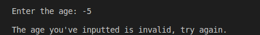
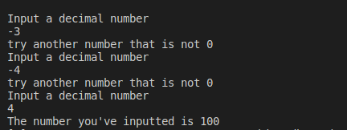

<h1 align="center">
 Welcome to unit 2:  
 CONTROL STRUCTURES AND CYCLES.  
 
 ### In this unit we will see structures and loops like (for, if, else if, else, do while, while) this will help us solve problems and program more easily.   
  
# Index   

Practice Exercises  
Exercise 1  
Exercise 2  
Exercise 3  
Exercise 4  
Exercise 5  
Exercise 6  
Exercise 7  
Exercise 8    
# Explanation of all the exercises  

## Exercise 1.  Write a program that asks the user for their annual income and displays by screen the corresponding tax.  
#### Input
```c++
    cout << "Input your annual rent:" << endl;  
    cin >> Renta;  
```    
#### Process
 ``` c++
 if (renta > 0)
    {
        if(renta < 10000)
        {
            porcentaje =.05;
            impuesto = renta*.05;
        }
        else if((renta >=10000)&&(renta < 20000))
        {
            porcentaje =.15;
            impuesto = renta*.15;
        }
        else if((renta >=20000)&&(renta < 35000))
        {
            porcentaje =.20;
            impuesto = renta*.20;
        }
        else if((renta >= 35000)&&(renta < 60000))
        {
            porcentaje =.30;
            impuesto = renta*.30;
        }
        else if (renta >= 60000)
        {
            porcentaje =.45;
            impuesto = renta*.45;
        }
```  
#### Exit  
```c++  
cout << endl << "Your annual rent is: $" <<renta << endl;
        cout << "Your tax is " << (porcentaje)*100 << "%: $" << impuesto << endl; 
        cout << "Total amount to pay is: $" << renta+impuesto << endl;
        cout << "$ " << renta << "      " << (porcentaje) *100 << "%             $ " << impuesto << "         $ " << porcentaje << endl;
    }
```  
#### Justification  
The program works like this:  
1. Ask the user to write their annual rent.
2. The user types in their annual rent.  
3. Depending on the amount entered, the program will give the tax and the total amount with the amount included.  
4. If the amount is less than $10,000, the porcentage will be equal to: 5%.  

5. If the amount is less than or equal to $10,000 or less than $20,000, the porcentage will be equal to: 15%.  

6. If the amount is less than or equal to $20,000 or less than $35,000, the porcentage will be equal to: 20%  

7. If the amount is less than or equal to $35,000 or less than $60,000, the porcentage will be equal to: 30%  
8. If the amount is greater than or equal to $60,000, the porcentage will be equal to: 45%.  
#### Examples  
For each case:  
**a)** 1 - 9999  
<div align ="center">  

</div>  

**b)** 10000 - 19999 
<div align ="center">  

</div>   

**c)** 20000 - 34999
<div align ="center">  

</div>  

**d)** 35000 - 59999
<div align ="center">  

</div>  

**e)** +60000
<div align ="center">  

</div>  

<br /><br /><br />   

## Exercise 2.  Beneficts: The program must calculate the qualification of the employees of a company.  

#### Input
```c++
    cout << "Enter the qualification of your employee: ";
    cin >> puntuacion;  
```  

#### Process  
```c++  
if((puntuacion == 0.0)||(puntuacion == 0.4)||(puntuacion >= 0.6))
   {
    if(puntuacion == 0.0){
    cout << "It is unacceptable: ";
    }  
   else if(puntuacion == 0.4){
   cout << "It is acceptable: ";
   }
   else if(puntuacion >= 0.6){
    cout << "It is meritorious: ";
   }
   cout << "\nHas an evaluation of: " << puntuacion << "\nThe employee will receive: " << (puntuacion*100) << "%:$" << (bono*puntuacion) << "\n";
   }  
```  
#### Exit  
```c++  
else {
    cout << "Try again, the punctuation entered is incorrect: ";
   }  
```  

#### Justification  
The program works like this:  
1. Ask the user for their rating on a scale of 0 to 1.  
2. If the user enters a value other than 0, 0.4 or a number greater than 0.6, the program does not run and says that the grade is invalid.  
3. If the user enters a valid value, print what level the employee has followed by the percentage and the value of the bonus.  
4.and tells you if it is unacceptable, acceptable or meritorious.  
#### Examples  
For each case:  
**a)**  Unacceptable 0.0
<div align ="center">  

</div>  

**b)**  Acceptable 0.4
<div align ="center">  

</div>   

**c)** Meritorious 0.6 ó +
<div align ="center">  

</div>   

**d)** Invalid
<div align ="center">  

</div>   
 
<br /><br /><br />  

## Exercise 3.  Game center customer price.   

#### Input
```c++  
cout << "Enter the age: ";//Ask for the customer age
cin >> edad;  
```  
#### Process   
```c++  
if(edad < 4){
        cout << "Entrance is free" << "\n";
    }
    if((edad >=4)&&(edad <= 18)){
        cout << "The amount to pay is $5 " << "\n";
    }
    if(edad > 18){
        cout << "The amount to pay is $10 " << "\n"; 
    }   
```  

#### Exit  
```c++  
    else
    {
        cout << "\nThe age you've inputted is invalid, try again.\n";
    }
```  

#### Justification  
The program works like this:  
1. ask the user the age. 
2. Depending on the age, a price is assigned, if you are between 0 and less 4 years old, the entrance is free.  
3. If you are between the ages of 4 and 18, you are charged $5.
4. If you are over 18 you are charged $10.  
5. If you enter an invalid age or a negative number you get an error.  
#### Examples  
For each case:  
**a)**  0 - <3 
<div align ="center">  

</div>  

**b)**  4 - 18
<div align ="center">  

</div>   

**c)** +18
<div align ="center">  

</div>   

**d)** Invalid
<div align ="center">  

</div>  
<br /><br /><br />  

## Exercise 4. Pizza: Vegetarian pizza ingredient selection.  
#### Input
```c++
cout << "Welcome customer to Bella Napoli Pizzeria!\nAll our pizzas have mozzarella and tomato\nWould you like a vegetarian pizza? (Y/N)\n";
    cin >> response;     
```  

#### Process  
```c++  
if (response == 'Y' || response == 'N' || response == 'y' || response == 'n')//Check if the user typed in a valid response
    {
        if (response == 'Y' || response == 'y')//Vegetarian options
        {
            do
            {
                cout << "Select an ingredient: \n 1. Pepper\n 2. Tofu\n";//Loop the ingredient selection until a valid response (vegetarian)
                cin >> ingredient;
            } while (ingredient < 1 || ingredient > 2);
        }
        else if (response == 'N' || response == 'n')//Non-vegetarian options
        {
            do
            {
                cout << "Select an ingredient: \n 1. Pepperoni\n 2. Ham\n 3. Salmon\n";//Loop the ingredient selection (meat)
                cin >> ingredient;
            } while (ingredient < 1 || ingredient > 3);
            index = 1;//Locate the ingredient on the "meat section"
            selector = 1;//Display a nonvegetarian pizza type
        } 
```  
#### Exit  
```c++  
cout << "Your " << pizzatype[selector] << " pizza has the following ingredients:\n Mozarella \n Tomato\n " << extraingredient[ingredient + index] << endl;//Print out all the ingredients and print out the extra ingredient based on the value inputted by the user
    }
    else
    {
        cout << "You've inputted an invalid response, try again\n";
    }
```  

#### Justification  
The program works like this:  
1. Declare a list of extra ingredients.
2. Ask the user if they would like a vegetarian pizza or not.  
2.1. If the user inputs an invalid response, exit the program.
3. If they chose vegetarian, show a list of the possible extra ingredients and let the user input a number to choose.
4. If they chose non-vegetarian, move the declared list of extra ingredients to the "meat section" and let the user input a number to choose the extra ingredient.
5. Print out the selection of extra ingredients with the default ingredients (Mozarrella and Tomato)
6. Return 0 to check that the program ran succesfully.  
   
#### Examples  
For each case:  
**a)** Non-Vegetarian Pizzas
<div align ="center">  


</div>  

**b)** Vegetarian Pizzas
<div align ="center">  


</div>   

**c)** Invalid Response 
<div align ="center">  

</div>   

**d)** Invalid Extra ingredient loop 
<div align ="center">  

</div>   
 
<br /><br /><br />  

## Exercise 5. Temperature: Average temperature, maxium and minium value.  
#### Input
```c++  
do{
 cout <<"Give me the temperature: ";
 cin >> temperature;
```  

#### Process  
```c++  
     if(temperature >= maxTempe)
        {
            maxTempe = temperature;
        }
        if(temperature <= minTempe)
        {
            minTempe = temperature;
        }
        tempAcum += temperature;
        counter++;
}while(counter <= 6);
    average = tempAcum / 6;
```  
#### Exit  
```c++  
cout << "The average of temperature today is: " << average << "C°\n lowest temperature " <<minTempe << " C° \n highest temperature " <<maxTempe <<" C°\n" <<endl;
```  

#### Justification  
The program works like this:  
1. The program is about calculating 6 inputs of a temperature value. Each input gains a new etiquette, either max temperature or minium temperature using the previous value as reference.
2. Ask for user input about current temperature 6 times. The value can be a float value.  
3. Calculate the average of the values inputted by the user.  
4. Output the average, minium and maxium value of the 6 inputs.  
5. Return 0 to check that the program ran correctly.  
#### Example  
  
**Temperatures**  
<div align ="center">  

</div>  
  
  
 
<br /><br /><br />  

## Exercise 6. Invoice:Products selling totals 
#### Input
```c++
cout << "Welcome, please input the amount and price of your products. To end the program, type a 0\n\n";
```  

#### Process  
```c++  
  do
    {
        cout << "producto" <<quanty << "\n Amount: ";
        cin >> amount;
          if( amount <= 0){
            cout << "\n Invalid amount";
            quanty++;
            break;
          } 
            
        
        cout << "Enter the price of the item:$ ";
        cin >> price;
        if(price < 0)
        {
            cout <<"\n Invalid amount";
            quanty++;
            break;
        }
        quanty++;
        total += (price * amount);
        } while (price != 0);
```  
#### Exit  
```c++
    cout << "\n has a total of " << quanty -2 <<" different products. ";
    cout << "\n Total is: $ " <<total;
```  

#### Justification  
The program works like this:  
1. Ask the user to write the amount sold of product  
2. Ask the user to write the price that each individual piece of product was sold  
3. If the user writes a 0 in the price value, exit the program  
4. If the user writes 0 or less in the price or amount value, exit the program  
5. Print out the number of products that were inputted  
6. Print out the total sum of money profitted.
7. Return 0 to check that the program ran correctly.

#### Examples  
For each case:  
**a)**  Valid case
<div align ="center">  

</div>  

**b)**  Invalid case (invalid product numbers)
<div align ="center">  

</div>  

**c)**  Invalid case (Invalid price numbers)
<div align ="center">  

</div>    

 
<br /><br /><br />   

## Exercise 7. Binary: Decimal number to binary value 
#### Input
```c++
do{

        cout<<"Input a decimal number \n";
        cin>>num;
```  

#### Process  
```c++  
if(num > 0)
        {
            
            while(num > 0)
            {
            
                (num % 2 == 0)?binary = '0' + binary:binary = '1' + binary;
                num /= 2;
            }
```  
#### Exit  
```c++  
 cout << "The number you've inputted is " << binary;//Output of the string
            cout << endl;
        }
        else if(num==0)
        {
            cout<<"0"<<endl;
        }
        else{
            cout<<"try another number that is not 0"<<endl;
        }
   
    }while(num < 0);
```  

#### Justification  
The program works like this:  
1. The user writes a normal decimal value (it must be a whole number) and the program outputs the number but written in binary, ask the user to input a value  
2. In case the user writes a 0, exit the program  
3. In case the user writes a negative number, loop the program  
4. If the number written is valid, keep dividing the number by two and keep writing the residue of the division until the number is equal to 0  
5. Print out the string of values done by the formula  
6. Return 0 to check that the program ran correctly
#### Examples  
For each case:  
**a)** Valid run 
<div align ="center">  

</div>  

**b)** Invalid Run (0 input)
<div align ="center">  

</div>   

**c)** Invalid Run loop (negative number input)
<div align ="center">  

</div>   
 
<br /><br /><br />  

## Exercise 8. Multiplication table: Product of a number done X times in a table format   
#### Input
```c++
cout << "What number do you want the table to be: " <<endl;
    cin >> numero;

    
    cout << "Enter the limit: " <<endl;
    cin >> limit;    
```  

#### Process  
```c++  
for (int i = 0; i <= limit; i++)
    {
       for(int f = 1; f <= 48; f++)
    {
        cout << "-";     
    }
    cout<<endl;  
```  
#### Exit  
```c++  
 resultado=numero*i;
        cout << "| " << "\t" << i << "\tX" << "\t" << numero << "\t=" << "\t" << resultado << "\t" << "|" <<endl;
    }
```  

#### Justification  
The program works like this:  
1. The program asks the user to input a number to be the multiplying factor of the table, it then asks how many times should it do the multiplication scaling 1 to 1 (i.e 1 * X, 2 * X, 3 * X...).

2. Ask the user for the number to multiply the values by.
3. Ask the user how many times should the program run.
4. Using For and /t, make a table format to visualize the results.
5. Return 0 to check that the program ran succesfully.   
#### Examples    
**Multiplication table**  
<div align ="center">  

</div>  
 
<br /><br /><br />  

## Exercise 9. Bisection: Find the root in a graph using the bisection method.
#### Input
```c++
cout << "This graph is using the formula x²+x-12 \n";
cout << "Give me the value of (a):";
cin >> a;
cout << "Give me the value of (b):";
cin >> b;  
```  

#### Process  
```c++  
c = (a+b)/2;
    ya = bisection(a);
    yb = bisection(b);
    yc = bisection(c);
    if ((yb * ya < 0) || (ya * yc < 0) || (yc * yb < 0)){//Check to see if there is a root between the numbers before making anything
    cout << "| Exerc | A \t\t| B \t\t| C \t\t| f(A) \t\t| f(B) \t\t| f(C) \t\t| \n";//Table Header
    for (int i = 0; i < 100; i++)
    {
        cout << "-";
    }
    cout << "\n";
    cout << "| " << counter << "\t|" << fixed << setprecision(3) << a << "\t\t|" << b << "\t\t|" << c << "\t\t|" << ya << "\t\t|" << yb << "\t\t|" << yc << "\t\t|\n";
    for (int i = 0; i < 100; i++)
    {
        cout << "-";
    }
    cout << "\n";

        while (yc >= 0.01 || yc <= -0.01)
        {
            if ((yc > 0 && ya < 0) || (ya > 0 && yc < 0))//Set up b as the new limit (c) and then c would be the half of the previous value
            {
                b = c;
            }
            else
            {
                a = c;
            }
            if (a == b)//If point b ends being point b, the cycle would loop infinately, this prevents that
            {
                break;
            }
            
            c = (a+b)/2;
            ya = bisection(a);
            yb = bisection(b);
            yc = bisection(c);
            counter++;
            cout << "| " << counter << "\t|" << fixed << setprecision(3) << a << "\t\t|" << b << "\t\t|" << c << "\t\t|" << ya << "\t\t|" << yb << "\t\t|" << yc << "\t\t|\n";
            for (int i = 0; i < 100; i++)
            {
                cout << "-";
            }
            cout << "\n";
        }
```  
#### Exit  
```c++  
cout << "The root is approximately " << setprecision(1) <<  c;
    }
    else 
    {
        cout << "There's no root between the numbers";
    }
```  

#### Justification  
The program works like this:  
1. The program uses a default formula for calculating the root between two numbers It first asks the user to input two location in the X axis in the graph, it then determines wheter theres a root between them or not. Afterwards it applies the formula to said inputs and if the results are opposite signs (one is negative and the other positive), there is a root in between them; It then cuts in half the distance between the two points and compares signs with both extremes following the same principle to find out where the root is. Finally, it prints out a table listing all the process it did to find the root and prints out an approximation of where the root is.  
2. Ask the user to input a number in the X axis of the graph
3. Apply the formula to the numbers.  
4. If the signs are opposites, there is a root in between  
5. If the signs are the same, there is no root between them.  
6. Cut the distance in between the locations in half, check both extremes to see if the signs are opposites again 
7. Repeat the process until the formula reaches an approximation to 0-+0.01).  
8. Print out the table listing all the process behind calculating the root  
9. Print out the root  
10. Return an integer (0) because the main function is an integer to check that the program ran succesfully.  
#### Examples  
For each case:  
**a)**  
<div align ="center">  

</div>  

**b)**  
<div align ="center">  

</div>   

**c)** 
<div align ="center">  

</div>   
<br /><br />
<br /><h3 align="center">
[Return to Index]() 
<br /><br /><br />