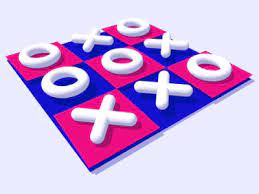
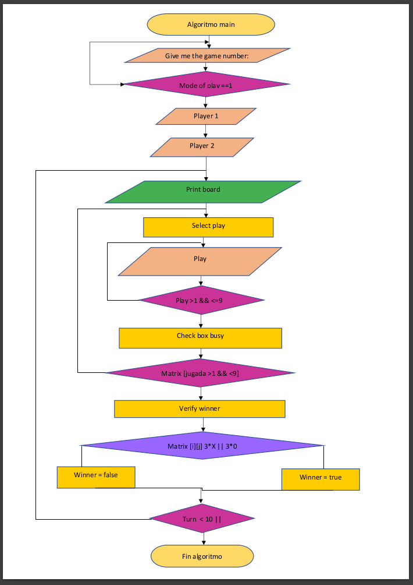
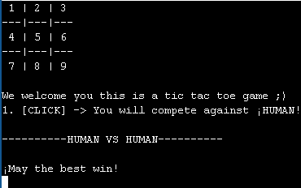
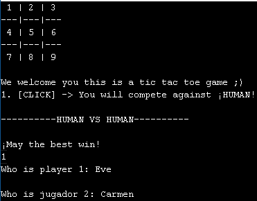
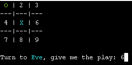
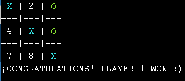
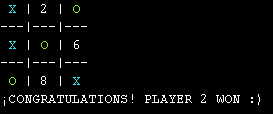
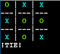

<h1 align="center">

 <h2 style="color:#33FFA5"> TIC TAC TOE 

 
</h1>  

# INDEX  
1. [CODE TIC TAC TOE](03_Gato.cpp)
2. [INSTRUCTIONS](#instructions)  
   2.1 [HOW TO PLAY (LINUX)](#how-to-play--linux)  
   2.2 [GENERAL CONSIDERATIONS](#general-considerations)  
3. [FLOWCHART](#flowchart)
4. [CODE EXECUTION](#code-execution)
5. [CONCLUSION](#conclusion)  
         
  
<h1 align="center">

  

## INSTRUCTIONS

 
</h1>  

### HOW TO PLAY  (LINUX)
1. Download or clone the directory in github. (Using the command git clone https://github.com/UP210659/UP210659_CPP.git). Later you go to U3 and GATO.CPP or you just go to the code [CODE TIC TAC TOE](03_Gato.cpp).  
2. Make sure you have a C++ compiler and that it runs the code.
3. The game is one against one
4. To enter the game you must put the number one, if you put a different number the game ends and it does not let you enter
5. Later the game will ask you for the name of player 1 and player 2. 
    
  
### GENERAL CONSIDERATIONS  
1. Player 1 is assigned "X" and is the same color as his name (blue)  
   
 _note: player 1 will always do "X"_  

2. Player 2 is assigned "0" and is the same color as his name (cyan)  

 _note: player 2 will always do "0"_
 
3. Consider that if there are three in a line you win, it can be diagonal, horizontal or vertical

4. You must enter an integer number those that are shown inside the board so that the move is correct ✅

### _ERRORS_  
1. On the game board it does not specify that player 1 is "X" and player 2 is "0"  
      
[RETURN TO INDEX](#index)   

<h1 align="center">

  

## FLOWCHART

 
</h1>  

  

     

[RETURN TO INDEX](#index)   

<h1 align="center">

  

## CODE EXECUTION

 
</h1>
 1.The start of the game is shown, where you must place the number 1 to start the play, then it asks you for the name of the players, where player 1 is ❌ and player 2 is 🟢

2.
Here you can see which symbol is assigned to each player

3. It is shown that player 1 won
 

4. It is shown that player 2 won

5. Here both players were tied

     

[RETURN TO INDEX](#index)  

<h1 align="center">

  

## CONCLUSION 

 
</h1>    
It was a great challenge to carry out this program, since it was a bit complicated and it was necessary to resort to functions that we did not know, but our tutor always supported us and explained each of the doubts that arose, the game was very extensive, I I imagined that it would be much simpler, because making the code for it to work is easy, but including the board, asking for names, assigning the numbers in each box, verifying which box is occupied was very tedious, in short, there were quite a few things, but I really liked it a lot. I still need to modify the code so that the user can compete against the machine and the game is more interesting..
     

[RETURN TO INDEX](#index)
